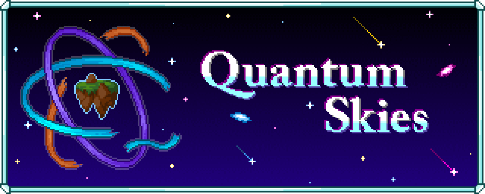

Quantum skies is a GTCEu-modern based skyblock modpack for Minecraft 1.20.1.

Resource acquisition is "classic" ex nihilo, with some alterations to suit gregtech's progression. The stone age features a lot of QoL that make it go by fast.

Many popular ex-ni skyblock addons, like simple cobble generators, are absent in favor of GT equivalents and custom machines and multiblocks.

Quantum Skies features the full steam age.

Pipez is available for early game logistics, but upgrades and filters are disabled. Flux Networks and Entangled are provided to make power, item, and fluid distribution _much_ simpler, but the last mile will have to be GT pipenets or AE2. Since nearly all resources are functionally unlimited in skyblock, a lot of power generation options are viable, but only GT sources exist.

To balance some of this out, there are no storage drawers.

Inspiration:

* Agrarian Skies, the original expert skyblock
* Gregblock, the original gregtech skyblock
* Gregicality Skyblock, gtceu skyblock before gtceu exists
* Sky Technology, a gtceu modern skyblock
* Gregtech Community Pack (+Modern), great GT tutorial pack

Credits:

* Many GT oritned quest lines are adapted directly or inspired by GCP
* AE2 greficiation is currently directly from GCP (may change, or not)
* Lanthanides, Platinum chain are from GTNH via GTEC (may be adapted further over time)

## Development

You will need java jre 17, make, and p7zip-full.

```sh
$ make build
```

This should build a full-zip with all mods included.

To support mods and resource packs that cannot be downloaded form the API, place them in `./cache/{mods,resourcepacks}` before running the build command.
